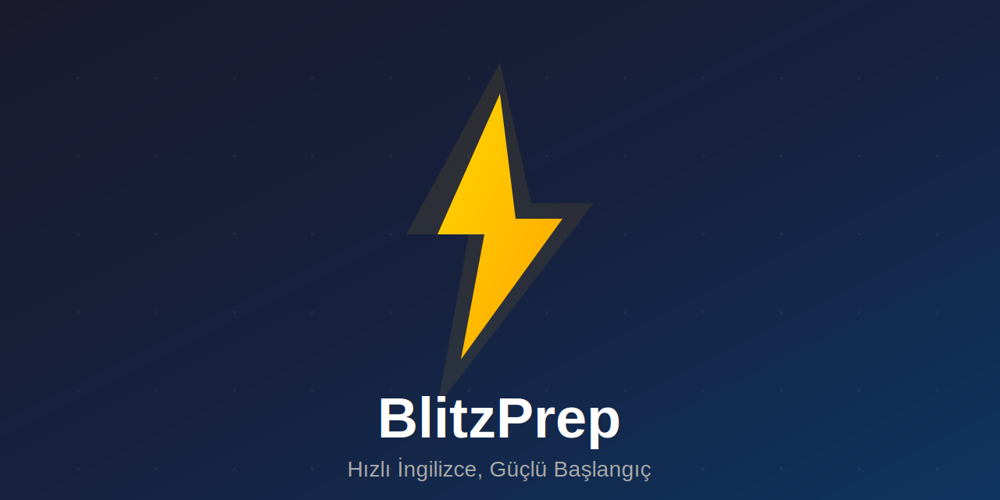

# ⚡ BlitzPrep

> **Hızlı İngilizce, Güçlü Başlangıç**

İngilizce öğrenmek isteyenler için geliştirilmiş interaktif hazırlık uygulaması. 804 kelime, gramer alıştırmaları, gerçek diyalog senaryoları ve quiz modlarıyla İngilizceni hızlıca geliştir.



---

## 📊 Özellikler

| Modül | İçerik | Açıklama |
|-------|--------|----------|
| 📚 **Kelime Kartları** | 804 kelime | BBC 800 + British Slang + İş İngilizcesi, akıllı tekrar sistemi |
| 🧠 **Gramer** | 5 konu, ~57 soru | Tenses, Articles, Prepositions, Modals, Conditionals |
| 💬 **Senaryolar** | 20 diyalog | Günlük yaşam + Apple Store yöneticisi senaryoları |
| ✏️ **Cümle Kurucu** | ~150 cümle | Türkçe → İngilizce yazma pratiği, 5 kategori |
| 🗣️ **Konuşma** | 10 senaryo | Serbest yazma, anahtar kelime kontrolü |
| 🎯 **Quiz** | 3 mod | Kelime / Gramer / Karışık, 10-30 soru |

---

## 🚀 Öne Çıkan Özellikler

### 🔄 Akıllı Tekrar Sistemi (Spaced Repetition)
Leitner sistemi ile kelimeleri tam unutmak üzereyken tekrar et:
- **Bildim** → seviye artar, tekrar aralığı uzar (1dk → 5dk → 30dk → 24sa → 3gün → 7gün)
- **Bilemedim** → seviye sıfırlanır, 1 dakika sonra tekrar sorulur

### 🔥 Streak Takibi
Her gün pratik yaparak serini devam ettir. 1 gün atlama = seri sıfırlanır.

### 📊 İlerleme Dashboard
- Günlük hedef takibi (varsayılan 20 aktivite/gün)
- Genel doğruluk oranı (%)
- Öğrenilen kelime sayısı
- Tamamlanan senaryolar

### 🇬🇧 British English Seslendirme
Tüm kelimeler ve cümleler İngiliz aksanıyla (en-GB) sesli okunur.

---

## 🛠️ Teknolojiler

- **React 19** + **TypeScript**
- **Vite** — Hızlı build tool
- **Lucide React** — İkonlar
- **Speech Synthesis API** — British English seslendirme
- **localStorage** — İlerleme takibi (backend gerektirmez)

---

## 📦 Kurulum

```bash
npm install
npm run dev
```

## 🏗️ Build

```bash
npm run build
```

`dist` klasöründeki dosyalar herhangi bir statik hosting'e (Vercel, Netlify, GitHub Pages, kendi sunucun) yüklenebilir.

---

## 📁 Proje Yapısı

```
src/
├── hooks/
│   └── useProgress.ts         # İlerleme + Spaced Repetition
├── components/
│   ├── Dashboard.tsx          # Ana sayfa, istatistikler
│   ├── Vocabulary.tsx         # 804 kelime kartı
│   ├── Grammar.tsx            # 5 gramer konusu
│   ├── Quiz.tsx               # Quiz modu
│   ├── Scenarios.tsx          # 20 diyalog senaryosu
│   ├── SentenceBuilder.tsx    # Cümle kurma pratiği
│   └── Conversation.tsx       # Konuşma pratiği
└── data/
    ├── bbc-words.ts           # 804 kelime + Türkçe çeviriler
    ├── grammar.ts             # Gramer soruları
    ├── content.ts             # Senaryolar
    ├── sentences.ts           # Cümle verileri
    └── conversations.ts       # Konuşma senaryoları
```

---

## 📸 Ekran Görüntüleri

> Uygulamayı çalıştırmak için `npm run dev` komutunu kullanın.

---

## 🚀 Gelecek Planlar

- [ ] **PWA Desteği** — Offline çalışma, telefona yükleme
- [ ] **Telaffuz Pratiği** — Speech Recognition ile konuşma doğrulama
- [ ] **Gramer Genişletme** — Passive voice, reported speech, relative clauses
- [ ] **Seviye Sistemi** — A1, A2, B1, B2 seviye tespiti
- [ ] **Karanlık Mod** — Gece çalışması için dark theme
- [ ] **İstatistik Grafikleri** — Haftalık/aylık ilerleme

---

## 📝 Lisans

Kişisel kullanım projesi.

---

**⚡ BlitzPrep** — Hızlı İngilizce, Güçlü Başlangıç
